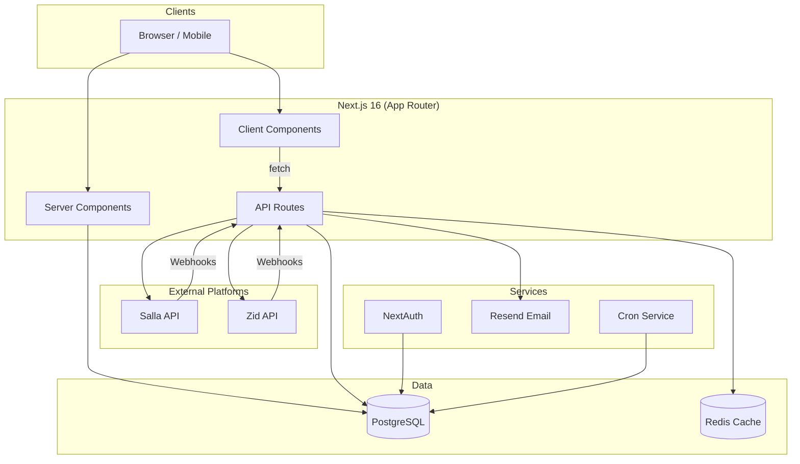
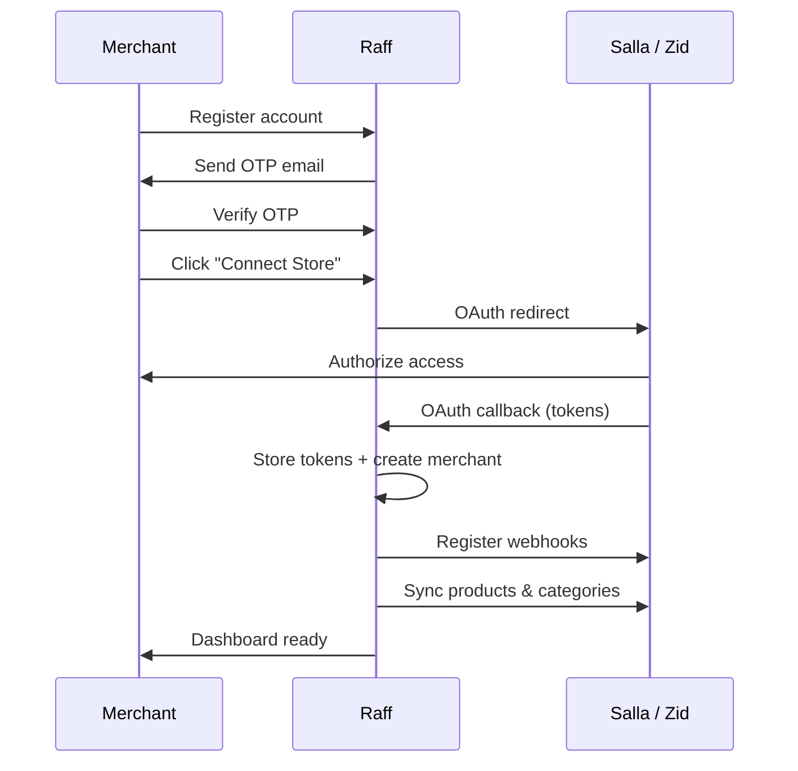
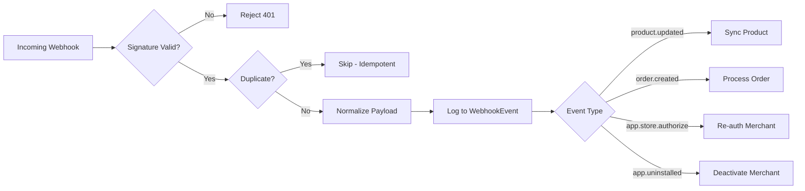
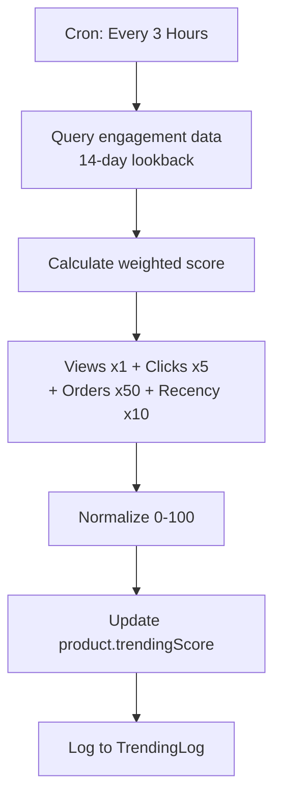
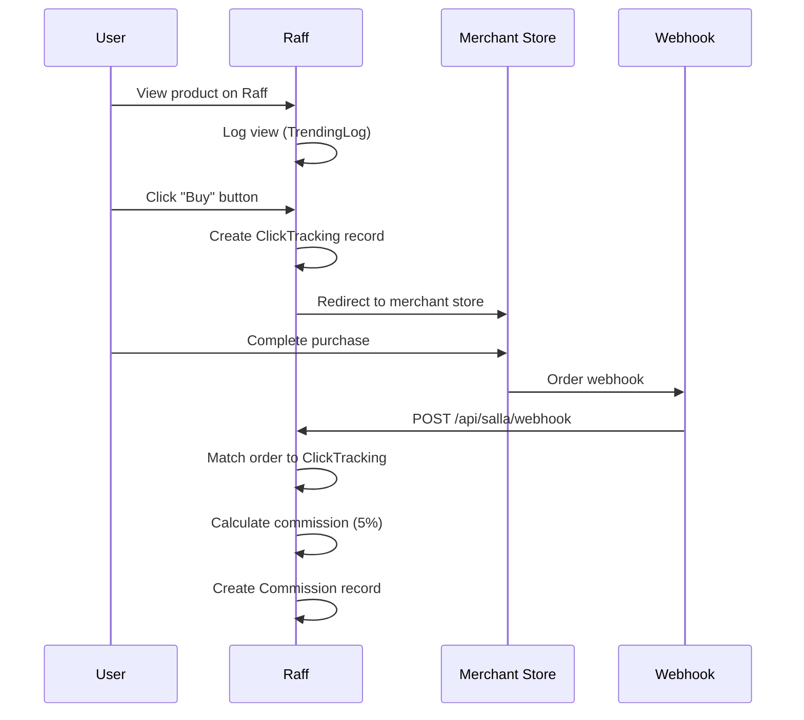
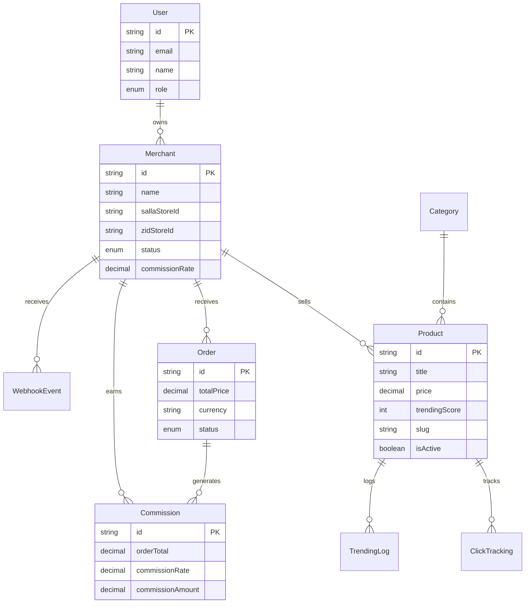

# Raff - E-Commerce Discovery Platform

> One shelf, many stores — Discover trending products from Saudi online stores.

Raff is a product discovery and aggregation layer built on top of existing Saudi e-commerce platforms. It connects merchants from **Salla** and **Zid** through OAuth, syncs their catalogs, and surfaces trending products to customers — all while orders are fulfilled by the original stores.

---

## Tech Stack

| Layer            | Technology                                          |
|------------------|-----------------------------------------------------|
| Framework        | Next.js 16 (App Router, Turbopack)                  |
| UI               | React 19, TailwindCSS 4, Framer Motion 12           |
| Language         | TypeScript 5.8                                      |
| Database         | PostgreSQL 14+ via Prisma 6 ORM                     |
| Authentication   | NextAuth 4 (JWT sessions, Prisma Adapter)           |
| Email            | Resend 6                                            |
| Validation       | Zod 3, React Hook Form 7                            |
| i18n             | next-intl 4 (Arabic default, English)               |
| Deployment       | Docker, Railway                                     |

---

## Architecture Overview



---

## Merchant Onboarding Flow



---

## Webhook Processing Pipeline



---

## Trending Score Calculation



---

## Click Attribution & Commission Flow



---

## Data Model



---

## Key Features

### Multi-Platform OAuth Integration
Merchants connect their **Salla** or **Zid** stores through a full OAuth 2.0 flow. After authorization, Raff automatically syncs products, categories, and store metadata. Token refresh is handled transparently, and webhook endpoints are registered on the merchant's behalf.

### Automated Trending System
A weighted scoring algorithm ranks products based on real engagement data:
- **Views** (x1), **Clicks** (x5), **Orders** (x50), plus a **recency boost** (x10) for products added in the last 30 days.
- Scores are recalculated every 3 hours via a cron service with a 14-day lookback window.
- All engagement events are logged to `TrendingLog` for auditability.

### Conversion Tracking & Commissions
Click-through attribution links Raff traffic to merchant orders. When an order webhook arrives, the system matches it to a tracked click, calculates commission (configurable per merchant, default 5%), and logs the result. Idempotency constraints prevent duplicate processing.

### Fraud Detection
A risk scoring pipeline flags suspicious activity — high-frequency orders, self-purchase patterns, bot user-agents, and IP clustering. Signals are logged with severity levels and configurable thresholds per environment.

### Admin Dashboard
A real-time admin panel accessible on mobile for monitoring and managing the platform:
- **System Health** — Live status of DB, Salla API, and Zid API connectivity.
- **Console Logs** — All server-side errors stream to an in-memory LogStore, filterable by namespace.
- **Quick Actions** — Trigger syncs, recalculate trending, clear cache from your phone.
- **Alerts** — Pending merchants, expired tokens, stale syncs, products missing images.

### Full Internationalization (i18n)
The entire UI supports **Arabic** (default, RTL) and **English**. Translations live in `public/messages/` and are loaded server-side via `next-intl`. Dates use the `Asia/Riyadh` timezone.

### Webhook Processing Pipeline
Inbound webhooks from Salla and Zid pass through signature verification (HMAC-SHA256), payload normalization, idempotency deduplication, and event logging before reaching business logic. A 90-day retention policy keeps the audit trail manageable.

---

## Project Structure

```
raff/
├── prisma/                 # Schema, migrations, seed
├── scripts/                # Cron jobs, trending calculation, cleanup
├── public/messages/        # i18n translations (ar.json, en.json)
├── src/
│   ├── app/                # Next.js App Router (pages + API routes)
│   │   ├── admin/          # Admin dashboard
│   │   ├── merchant/       # Merchant dashboard & settings
│   │   ├── products/       # Product listing & detail pages
│   │   ├── api/            # API routes (auth, webhooks, CRUD)
│   │   └── ...             # Other pages (cart, orders, search)
│   ├── lib/
│   │   ├── platform/       # Unified Salla/Zid abstraction
│   │   ├── services/       # Business logic (email, OTP, notifications)
│   │   ├── sync/           # Product & store sync orchestration
│   │   ├── utils/          # Logger, helpers, formatting
│   │   └── auth/           # Auth guards, admin middleware
│   ├── features/           # Feature modules (navbar, footer, homepage)
│   ├── shared/             # Shared UI components
│   ├── core/               # i18n infrastructure
│   └── types/              # TypeScript definitions
├── docker-compose.yml
└── railway.json
```

---

## Getting Started

### Prerequisites

- Node.js 20+
- PostgreSQL 14+ (or use the included `docker-compose.yml`)
- A [Salla Developer](https://salla.dev) account and/or a [Zid Developer](https://web.zid.sa) account

### Installation

```bash
git clone https://github.com/your-username/raff.git
cd raff
npm install

# Copy environment template and fill in your values
cp .env.example .env.local

# Start PostgreSQL (if using Docker)
docker compose up -d

# Generate Prisma client and apply migrations
npm run db:generate
npm run db:push

# Start the development server
npm run dev
```

Open [http://localhost:3000](http://localhost:3000).

### Available Scripts

```bash
npm run dev               # Development server (Turbopack)
npm run build             # Production build
npm run start             # Production server (runs migrations first)
npm run lint              # ESLint
npm run typecheck         # TypeScript type checking
npm run db:generate       # Generate Prisma client
npm run db:push:dev       # Push schema to database
npm run db:migrate        # Create a new migration
npm run db:studio         # Open Prisma Studio
npm run db:seed           # Seed test data
npm run calculate:trending  # Recalculate trending scores
npm run cron:service      # Run scheduled tasks (trending + cleanup)
```

---

## Environment Variables

See [`.env.example`](.env.example) for the full list with inline documentation.

---

## Database Schema

Key models: `User`, `Merchant`, `Product`, `Category`, `Order`, `ClickTracking`, `Commission`, `FraudSignal`, `TrendingLog`, `WebhookEvent`, `Notification`.

See [`prisma/schema.prisma`](prisma/schema.prisma) for the complete schema.

---

## License

Proprietary — All rights reserved.
